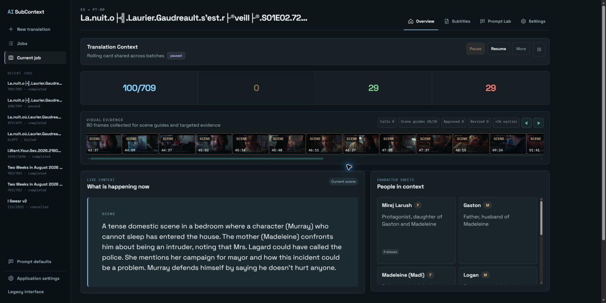

<a id="readme-top"></a>

[](https://discord.gg/EwKE8KBDqD)
[](https://github.com/diodiogod/ai-subcontext/stargazers)
[](https://github.com/diodiogod/ai-subcontext/issues)
[](https://github.com/diodiogod/ai-subcontext/network/members)
[](https://github.com/diodiogod/ai-subcontext)
[](https://ko-fi.com/diogogo)

# AI SubContext v0.2.5

Make quality subtitles with live context control using local models.

Drop an `.srt`, pick languages and model, watch the context card update, and intervene when needed.

<p align="center">
  
</p>

## Start Here

- [Launch](#launch)
- [What It Does](#what-it-does)
- [Features](#features)
- [Notes](#notes)

## Quick Links

- Local app URL: `http://127.0.0.1:7861`
- Windows launcher auto-switches to the next free port if `7861` is already in use.
- Linux launcher: [`start_linux.sh`](/mnt/j/aitools/subtitle-studio/start_linux.sh)
- Windows launcher: [`start_windows.bat`](/mnt/j/aitools/subtitle-studio/start_windows.bat)
- Review Workspace route: `/review/{job_id}`
- Prompt Lab route: `/prompt-lab`
- Tested model: [HauhauCS/Qwen3.5-35B-A3B-Uncensored-HauhauCS-Aggressive](https://huggingface.co/HauhauCS/Qwen3.5-35B-A3B-Uncensored-HauhauCS-Aggressive)
- Local runtime option: [LM Studio](https://lmstudio.ai/)

## What It Does

AI SubContext uses a large language model to translate subtitle files with context awareness, preserving meaning, terminology, and character consistency across an entire script instead of treating each line in isolation. It supports local or remote OpenAI-compatible endpoints, keeps a rolling context card while translation runs in batches, and gives you direct review tools when you need to inspect, fix, or retranslate individual lines.

Right now, testing has been centered on [LM Studio](https://lmstudio.ai/) using [HauhauCS/Qwen3.5-35B-A3B-Uncensored-HauhauCS-Aggressive](https://huggingface.co/HauhauCS/Qwen3.5-35B-A3B-Uncensored-HauhauCS-Aggressive).

## Features

### Translation

- translate `.srt` subtitles with local or remote OpenAI-compatible models
- choose source language, target language, model, and base URL
- add secondary subtitle languages as aligned reference tracks to help the model resolve ambiguity
- process subtitles in batches with live status and progress tracking
- validate an already translated `.srt` against the source without retranslating the whole file to fix or check untranslated segments.

### Context Control

- rolling structured context card with premise, tone, scene context, glossary, characters, and ambiguities
- live context updates as translation progresses
- edit the main context card while a job is running
- save, inspect, generate, and edit per-batch context snapshots
- edit all translation and context prompts through Prompt Lab

### Review

- dedicated Review Workspace with table-style line review
- suspect / fixed / error counters and filters
- per-line save, resolve, remove, and retranslate actions
- optional extra instruction when retranslating a line
- access batch cards directly from review flows
- verbose execution log with retry and validation events

### Reliability

- pause, resume, stop, and resume-from-failed translation jobs
- stricter retry, batch autosplit, and weak-model recovery handling
- less aggressive isolated auto-retry so borderline lines stay available for manual review
- invalid JSON model errors are surfaced with clearer messages
- translated exports append a branded final disclosure subtitle

## Launch

Windows:

```bat
start_windows.bat
```

Linux:

```bash
./start_linux.sh
```

## Notes

- This project currently focuses on `.srt` only.
- It expects an OpenAI-compatible endpoint such as LM Studio, OpenRouter, or another compatible local or remote server.
- Prompt templates and runtime controls are editable in Prompt Lab.
- Settings are stored in browser local storage for convenience.
- Jobs are persisted to `data/jobs.json`, and unfinished translation jobs are restored as paused on startup.
- Review imports detect and ignore AI SubContext's own branded footer subtitle automatically.

- AI SubContext was developed with inspiration from Bazarr workflows and [LavX/ai-subtitle-translator](https://github.com/LavX/ai-subtitle-translator).

